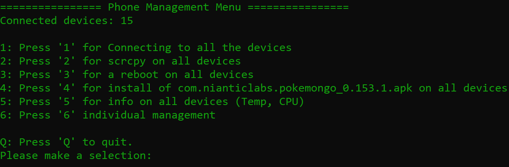

# PhoneManagement
This little powershell application will help you manage your phones better with the help of adb (and scrcpy).



Right now the script is able to:

 - **Connecting** (PMM can connect to all your devices over adb)
 - **srcpy** (PMM can use srcpy to view your devices screens)
 - **rebooting** (PMM can reboot all of the connected devices)
 - **Device info** (PMM can check device info like temperature and cpu speed)

 ### Windows
 Right now this script is designed for windows 10 and to be run with powershell

 ### Setup/configuration
 **1. Config file**  
 - Copy config.example.ini to config.ini and fill out the WorkDirectory setting
 - (example: WorkDirectory=C:\PhoneManagement)

 **2. Devices file**  
 - Copy devices.example.csv to devices.csv and fill out like below:
   
 **Please make sure the csv file uses "," as the delimiter.**  
 - (You can also change this when opening the file with a text editor.)  

  **3. Scrcpy**  
    We recommend scrcpy for adb and opening the phone's screen.  
    - You can download the files [here](https://github.com/Genymobile/scrcpy)  
    Make sure to download the windows zip files and put them in the scrcpy folder.  
    Adb and scrcpy should be accessable from:
    ```bash
    \PhoneManagement\scrcpy\adb.exe
    ```

**4. Making a shortcut to start the script from anywhere (Optional)**  
Windows:
  - Right click where you want your shortcut
  - Go to new -> Shortcut
  - In the shortcut target box, paste and edit both the paths to your file locations: 
  ```bash
    powershell.exe -noexit -ExecutionPolicy Bypass -File "c:\path\PhoneManagement\Start.ps1"
  ```
  - Name the shortcut **we are not done!**
  - Right click the shortcut you just made
  - Properties
  - Find "start in", empty the line and fill in the path of PMM
  ```bash
  "c:\path\PhoneManagement\"
  ```
  - Hit apply and close the box
  - Now we're done! Enjoy your easy shortcut from anywhere

